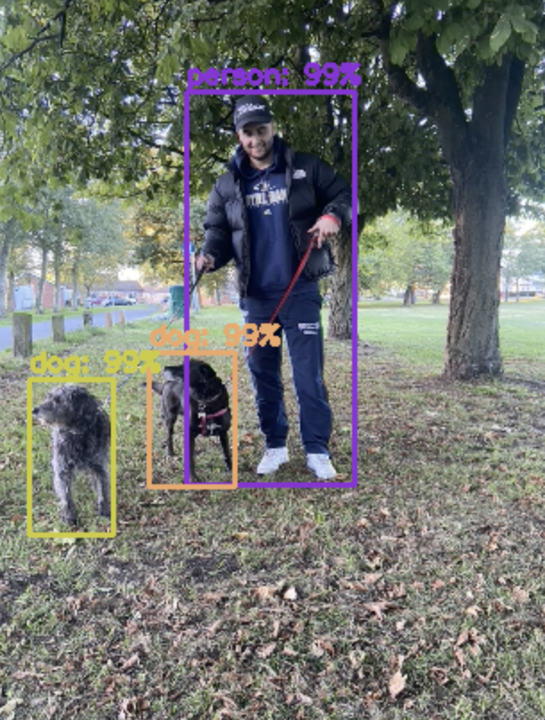

# YOLO (You Only Look Once): Used in research for Neuroprosthesis for object detection and classification 

----

## Background:
Object detection plays a crucial role in neuroprosthetics, which are designed to help individuals with disabilities by restoring or supplementing the function of their sight. Detecting objects and classfiying them is very important to allow the patients to live a safe and more comfortable life. 


## Instructions 

Access to the pre-trained models that are used for the weightings of the neural network as these models have been vigorously trained over an extended period of time. 

### For all the following commands, run within the following: 
```bat
cd /home/root/MyDirectory/
```
### Install the pre-trained models


#### yolov3.cfg 
```bat
$ wget https://raw.githubusercontent.com/pjreddie/darknet/master/cfg/yolov3.cfg
```
Each filter produces one channel so the number of output channels of a layer is given by "filters". The model is stored in the yolov3.cfg file.
#### yolo.weights
```bat
$ wget https://pjreddie.com/media/files/yolov3.weights
```
YOLO divides up the image into a grid of 19x19 cells. Each cell is responsible for predicting 5 bounding boxes. The image is divided into regions and predicts bounding boxes and probabilities for each region being what it thinks. The bounding boxes are weighted from the predicted probabilities. The pre-trained weights of the neural network are stored in the 'yolo.weights' file.
#### coco.names
```bat
$ wget https://raw.githubusercontent.com/pjreddie/darknet/master/data/coco.names
```
Contains the names of objects that are predicted to be seen on the image with the percentage classification to be presented next to them.

### Dog Output



### Image Output

