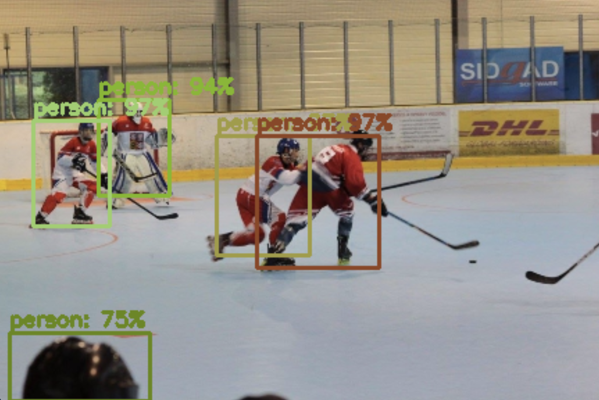

# YOLO (You Only Look Once): Used in research for Neuroprosthesis for object detection and classification 

----

## Background: Object detection plays a crucial role in neuroprosthetics, which are designed to help individuals with disabilities by restoring or supplementing the function of their sight. Detecting objects and classfiying them is very important to allow the patients to live a safe and more comfortable life:

### Output Dog

### Image Output

